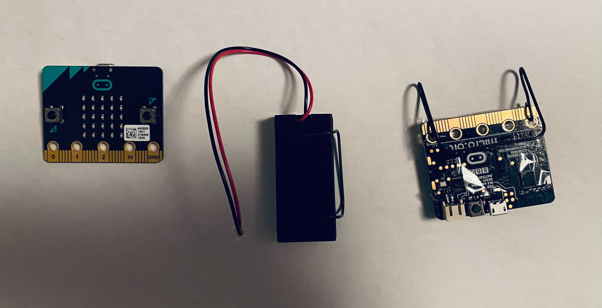

# Microposture

A program for two [micro:bit] devices for monitoring your back posture.

## Preparations

- You'll need two [micro:bit] devices.
- Flash `sensor.py` to the first one, e.g. `uflash sensor.py`. This device acts
  as the sensor.
- Flash `receiver.py` to the second one. This device acts as a data processor
  and display.
- Attach the sensor device to your back between the shoulder blades, powering it
  e.g. with a battery pack. See the picture below for my setup for strapping it
  to the shirt collar.
- Attach the display device somewhere you see it all the time, e.g. in the frame
  of your monitor. This device presumably needs more power, so it might be
  beneficial to power it from USB.

Here's a photo of my setup:

I used iron wire to make it possible to strap the sensor and the battery pack to
the collar of my shirt. Plastic tape is used to cover the pins and stuff that
might itch or irritate the skin.

## Usage

- Turn on both the sensor and the display device.
- The display shows an arrow at button A. Press it.
- Calibration begins. Sit or stand up staight until the display flashes all
  LEDs once. The program has now been calibrated.
- Now sit or stand with the same, good posture. The display shows how big a
  difference your posture has compared to the calibrated reference by drawing a
  a few dots. The more dots there are, the worse your posture is.
- If your posture crosses a threshold for about 10 seconds, the display starts
  flashing and you should correct your posture. Once the posture is good again,
  the flashing stops.
- If the display starts showing an arrow at button A again, it means that the
  sensor hasn't sent any measurements for about 10 seconds. Check that the
  sensor has power and start over at calibration.

## Background

I've always had a bad posture. After reading about the [Upright Go 2], I wanted
to build something similar with parts I already have.

## How it works

The sensor is dummy. It just sends the accelerometer reading over the radio
every 3 seconds and tries to minimize power consumption.

The display is the brain of the system. Calibration works by reading a few
measurements from the sensor and using their average as a reference direction of
the good posture. It then reads measurements from the sensor as they arrive,
computes the angle between the reference direction and the current accelerometer
reading, and displays the result.

[micro:bit]: https://microbit.org/
[Upright Go 2]: https://store.uprightpose.com/products/upright-go2
